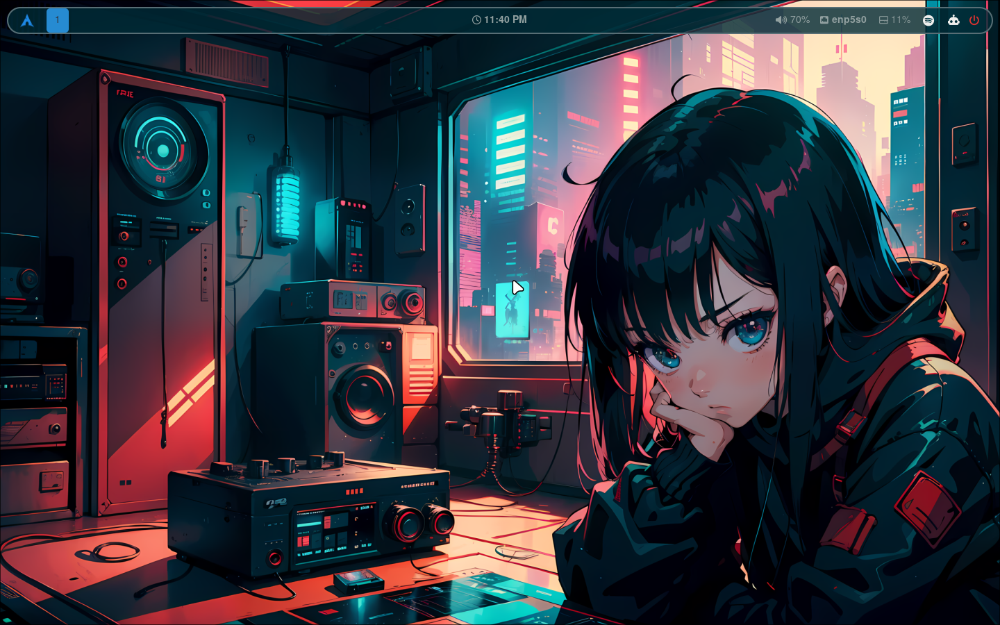
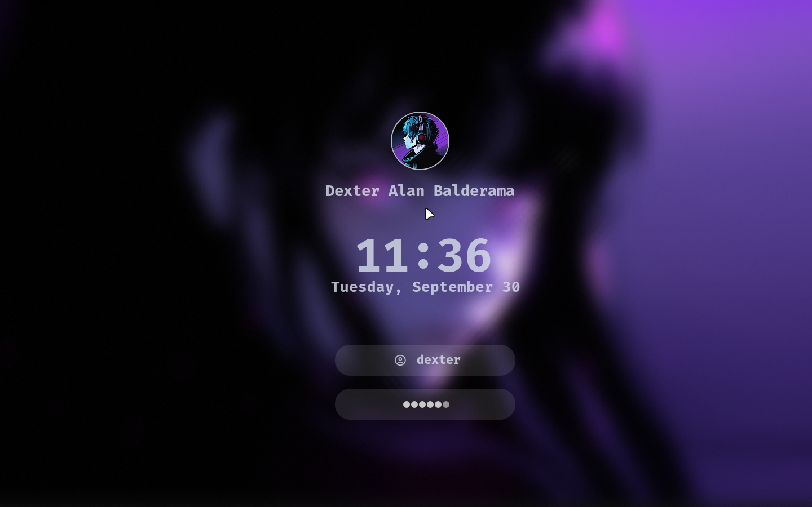
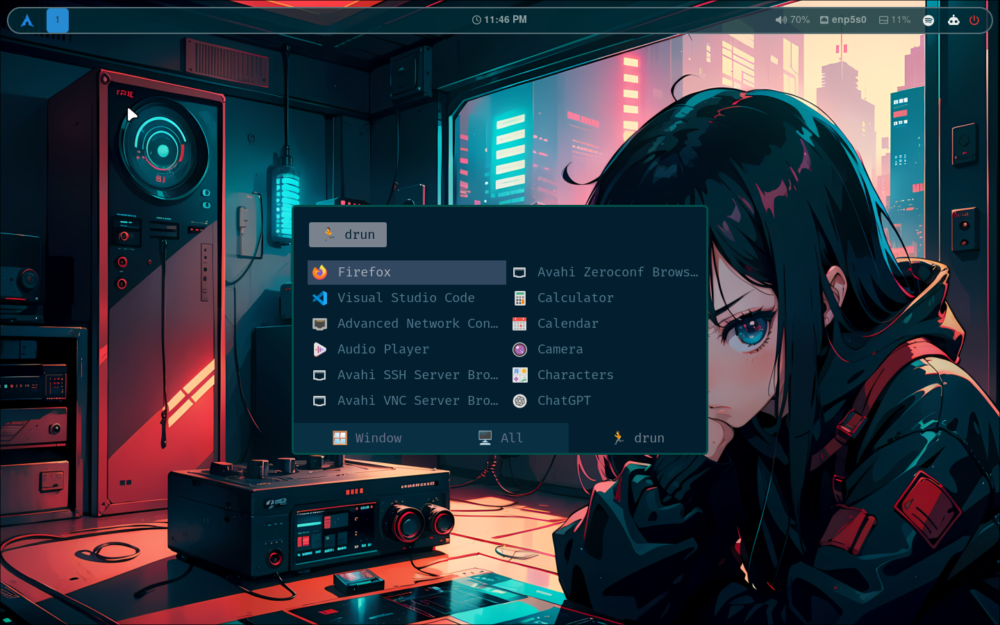
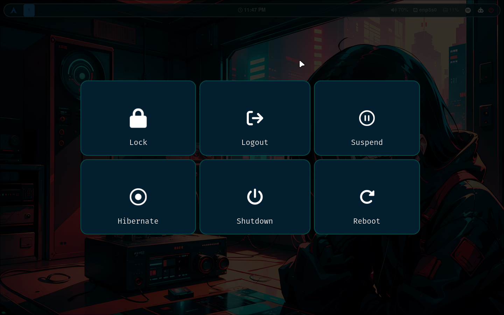
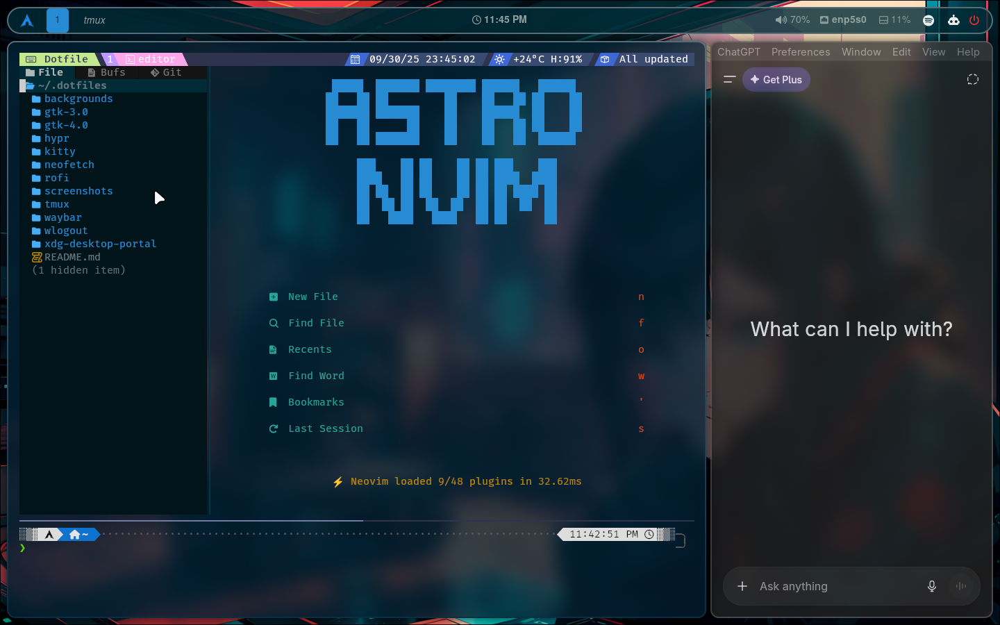
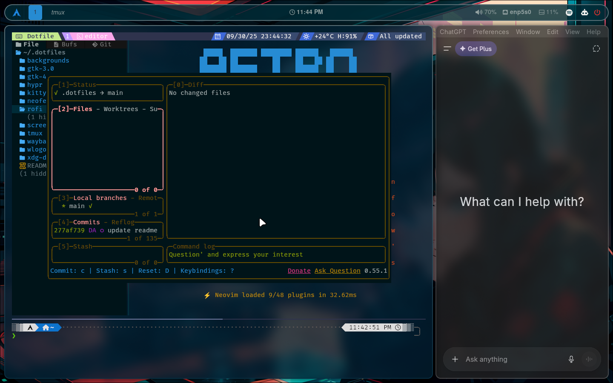

# My Dotfiles

Welcome to my dotfiles! This provides an overview of the packages I use, configurations, and installation steps for my setup.

---

### Preview Gallery

A full showcase of my Hyprland setup and tools:

| Desktop | Hyprlock | Application Launcher |
|---------|----------|-----------------------|
|  |  |  |

| Power Options | Tmux with ChatGPT | LazyGit |
|---------------|-------------------|---------|
|  |  |  |


### Packages

### Installed via `pacman`:
- `ttf-firacode-nerd`: Nerd Fonts with Fira Code.
- `ttf-font-awesome`: Font Awesome icons.
- `neovim`: Text editor.
- `firefox`: Web browser.
- `kitty`: Terminal emulator.
- `waybar`: Status bar for Wayland.
- `papirus-icon-theme`: Icon theme.
- `git`: Version control.
- `rofi`: Application launcher.
- `pavucontrol`: Audio control.
- `zsh`: Shell.
- `stow`: Dotfile manager.
- `wl-clipboard`: Clipboard utilities for Wayland.
- `lazygit` Simple terminal UI for git commands.
- `lazydocker`: Simple terminal UI for Docker and Docker Compose.
- `ripgrep` Command-line tool for searching text within files.
- `tmux` Terminal multiplexer.
- `xdg-desktop-portal-hyprland`: Hyprland support for desktop portals.
- `hyprland`: Wayland compositor.
- `hyprpaper`: Wallpaper manager for Hyprland.
- `hyprlock`: Lock screen.
- `hypridle`: Idle management for Hyprland.
- `swaync`: Notification center for Wayland.
- `network-manager-applet` Tray icon and GUI for managing network connections.
- `docker`: Containerization platform for building and running applications.
- `docker-compose`: Tool for defining and managing multi-container Docker applications.
- `dbeaver`: Universal database management tool.

### Installed via `yay` (AUR):
- `bibata-cursor-theme`: Cursor theme.
- `visual-studio-code-bin`: Code editor.
- `spotify`: Music streaming application.
- `wlogout`: Logout menu for Wayland.
- `hyprshot`: Screenshot tool for Hyprland.
- `neofetch`: System information tool.
- `gemini-cli`: Desktop client for Google Gemini.

---

## Installation Steps

### Installing `yay`
```bash
git clone https://aur.archlinux.org/yay.git && cd yay && makepkg -si
```

### Installing `Tmux Plugin Manager`
```bash
git clone https://github.com/tmux-plugins/tpm ~/.tmux/plugins/tpm
```

### Install `Oh My Zsh`
```bash
sh -c "$(curl -fsSL https://raw.githubusercontent.com/ohmyzsh/ohmyzsh/master/tools/install.sh)"
```

### Installing `powerlevel10k`
```bash
git clone --depth=1 https://github.com/romkatv/powerlevel10k.git ${ZSH_CUSTOM:-$HOME/.oh-my-zsh/custom}/themes/powerlevel10k
```

### Installing `AstroNvim`
```bash
git clone --depth 1 https://github.com/AstroNvim/template ~/.config/nvim
rm -rf ~/.config/nvim/.git
nvim
```

---

## Zsh Plugins

### `zsh-autosuggestions`
```bash
git clone https://github.com/zsh-users/zsh-autosuggestions ${ZSH_CUSTOM:-~/.oh-my-zsh/custom}/plugins/zsh-autosuggestions
```

### `zsh-syntax-highlighting`
```bash
git clone https://github.com/zsh-users/zsh-syntax-highlighting.git ${ZSH_CUSTOM:-~/.oh-my-zsh/custom}/plugins/zsh-syntax-highlighting
```

### `you-should-use`
```bash
git clone https://github.com/MichaelAquilina/zsh-you-should-use.git $ZSH_CUSTOM/plugins/you-should-use
```

Edit your `.zshrc` file:
- Add the following line to the very top of the file: `neofetch`.
- Add all those plugins to the `plugins` array.
- Find the line that sets `ZSH_THEME` and change its value to: `powerlevel10k/powerlevel10k`.

If Tmux Plugins not loading type these command
```bash
cd ~/.tmux/plugins/tpm/scripts && ./install_plugins.sh
```
---
