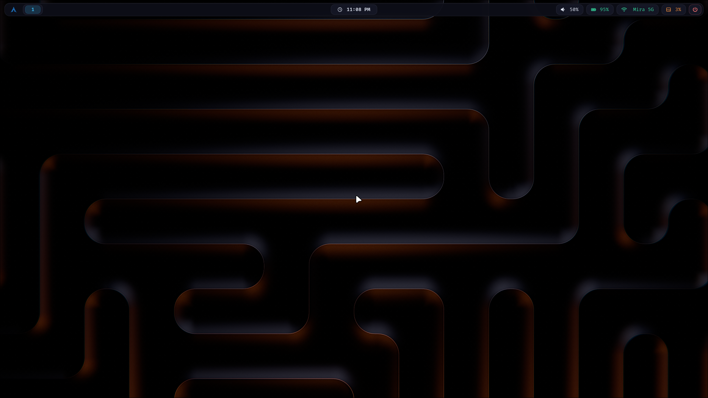
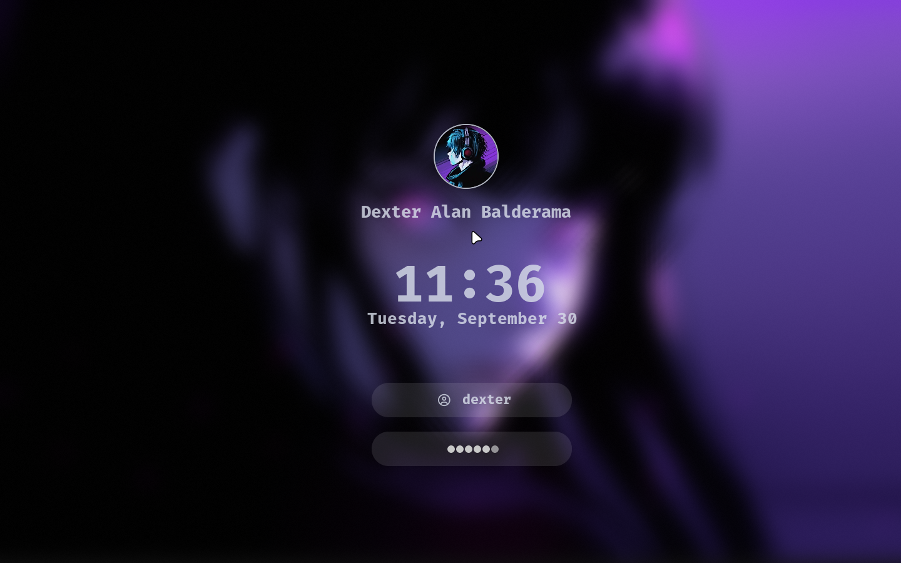
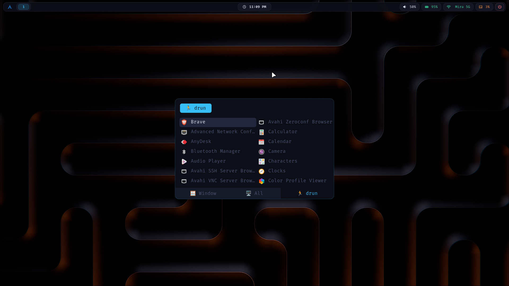
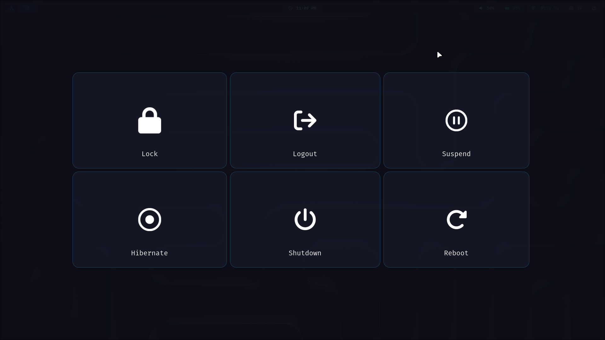
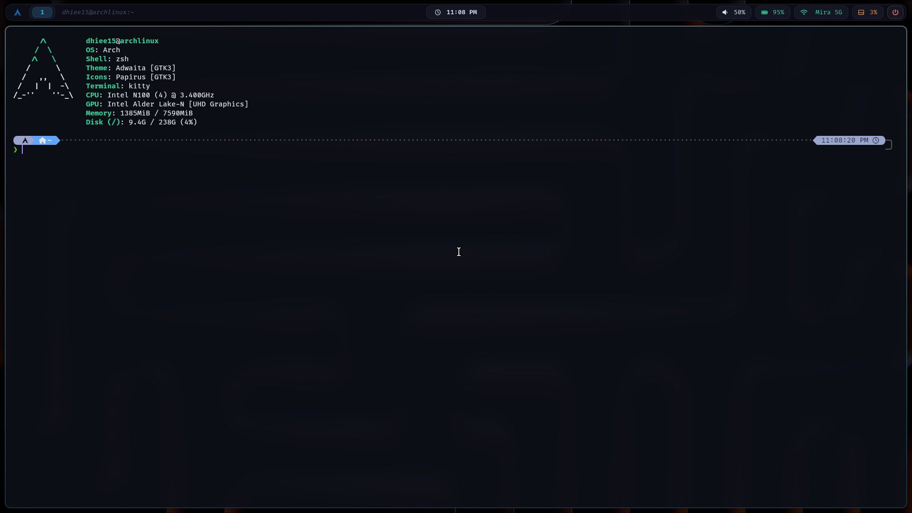
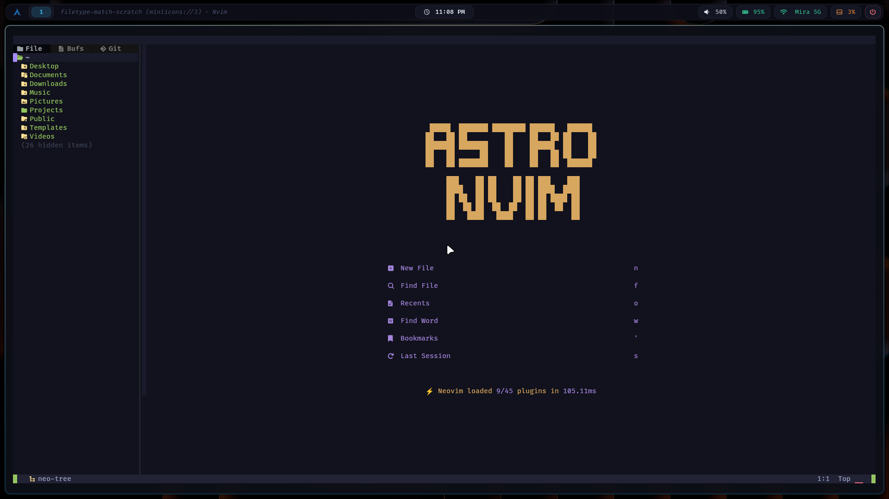

# My Dotfiles

Welcome to my dotfiles! This provides an overview of the packages I use, configurations, and installation steps for my setup.

---

### Preview Gallery

A full showcase of my Hyprland setup and tools:

| Desktop                                                  | Hyprlock                                        | Application Launcher                                                  |
| -------------------------------------------------------- | ----------------------------------------------- | --------------------------------------------------------------------- |
|  |  |  |

| Power Options                                                  | Terminal                                                  | AstroNvim                                                  |
| -------------------------------------------------------------- | --------------------------------------------------------- | ---------------------------------------------------------- |
|  |  |  |

### Packages

### Installed via `pacman`:

- `ttf-firacode-nerd`: Nerd Fonts with Fira Code.
- `ttf-font-awesome`: Font Awesome icons.
- `neovim`: Text editor.
- `kitty`: Terminal emulator.
- `waybar`: Status bar for Wayland.
- `papirus-icon-theme`: Icon theme.
- `git`: Version control.
- `rofi`: Application launcher.
- `pavucontrol`: Audio control.
- `zsh`: Shell.
- `stow`: Dotfile manager.
- `wl-clipboard`: Clipboard utilities for Wayland.
- `lazygit` Simple terminal UI for git commands.
- `ripgrep` Command-line tool for searching text within files.
- `tmux` Terminal multiplexer.
- `xdg-desktop-portal-hyprland`: Hyprland support for desktop portals.
- `hyprland`: Wayland compositor.
- `hyprpaper`: Wallpaper manager for Hyprland.
- `hyprlock`: Lock screen.
- `hypridle`: Idle management for Hyprland.
- `sddm`: Display manager.
- `qt5-declarative`: Qt Quick runtime required by the SDDM greeter.
- `qt5-quickcontrols2`: Qt Quick Controls runtime required by the SDDM theme.
- `swaync`: Notification center for Wayland.
- `brightnessctl`: Brightness control utility.
- `dbeaver`: Universal database management tool.
- `cava`: Display real-time sound waves

### Installed via `yay` (AUR):

- `bibata-cursor-theme`: Cursor theme.
- `wlogout`: Logout menu for Wayland.
- `brave-bin`: Web Browser.
- `hyprshot`: Screenshot tool for Hyprland.
- `neofetch`: System information tool.
- `swayosd`: On-screen display for volume and brightness.

---

## Installation Steps

### Installing `yay`

```bash
git clone https://aur.archlinux.org/yay.git && cd yay && makepkg -si
```

### Installing `Tmux Plugin Manager`

```bash
git clone https://github.com/tmux-plugins/tpm ~/.tmux/plugins/tpm
```

### Install `Oh My Zsh`

```bash
sh -c "$(curl -fsSL https://raw.githubusercontent.com/ohmyzsh/ohmyzsh/master/tools/install.sh)"
```

### Installing `powerlevel10k`

```bash
git clone --depth=1 https://github.com/romkatv/powerlevel10k.git ${ZSH_CUSTOM:-$HOME/.oh-my-zsh/custom}/themes/powerlevel10k
```

### Installing `AstroNvim`

```bash
git clone --depth 1 https://github.com/AstroNvim/template ~/.config/nvim
rm -rf ~/.config/nvim/.git
nvim
```

### Setting up `SDDM`

Install SDDM and the Qt libraries needed by the greeter:

```bash
sudo pacman -S sddm qt5-declarative qt5-quickcontrols2
```

Copy the SDDM config into the system config directory:

```bash
sudo mkdir -p /etc/sddm.conf.d
sudo cp ~/.config/sddm/sddm.conf /etc/sddm.conf.d/10-dotfiles.conf
```

Install the custom SDDM theme where the real SDDM service can read it:

```bash
sudo mkdir -p /usr/share/sddm/themes
sudo cp -r ~/.config/sddm/themes/dotfiles-modern /usr/share/sddm/themes/
sudo cp ~/.config/backgrounds/login.png /usr/share/sddm/themes/dotfiles-modern/login.png
```

Preview the theme before rebooting:

```bash
sddm-greeter --test-mode --theme /usr/share/sddm/themes/dotfiles-modern
```

If GDM is enabled, disable it before enabling SDDM:

```bash
systemctl is-enabled gdm
sudo systemctl disable --now gdm
```

Enable SDDM:

```bash
sudo systemctl enable sddm
```

---

## Zsh Plugins

### `zsh-autosuggestions`

```bash
git clone https://github.com/zsh-users/zsh-autosuggestions ${ZSH_CUSTOM:-~/.oh-my-zsh/custom}/plugins/zsh-autosuggestions
```

### `zsh-syntax-highlighting`

```bash
git clone https://github.com/zsh-users/zsh-syntax-highlighting.git ${ZSH_CUSTOM:-~/.oh-my-zsh/custom}/plugins/zsh-syntax-highlighting
```

### `you-should-use`

```bash
git clone https://github.com/MichaelAquilina/zsh-you-should-use.git $ZSH_CUSTOM/plugins/you-should-use
```

Edit your `.zshrc` file:

- Add the following line to the very top of the file: `neofetch`.
- Add all those plugins to the `plugins` array.
- Find the line that sets `ZSH_THEME` and change its value to: `powerlevel10k/powerlevel10k`.

If Tmux Plugins not loading type these command

```bash
cd ~/.tmux/plugins/tpm/scripts && ./install_plugins.sh
```

---
